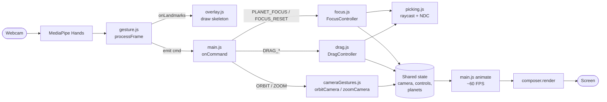

# gesture-3d-scene

An interactive 3D Solar System controlled entirely by **hand gestures** via your webcam — no mouse, no keyboard. Built with Three.js for rendering and MediaPipe Hands for real-time gesture recognition.

> Course project — **TP25216** *Real-Time 3D Object Placement and Manipulation Using Hand Gestures*.

---

## Features

- **5 hand gestures** drive the entire experience: orbit, zoom, drag-and-drop, focus, and reset.
- **8-planet solar system** with Kepler-style orbital speeds and self-rotation.
- **Drag-to-orbit snapping**: pull a planet to any orbit and it adopts that orbit's speed.
- **Focus mode**: zoom into any planet and the camera follows it through its orbit.
- **Camera-facing 3D labels** for each planet (auto-billboard sprites).
- **Cinematic visuals**: ACES tone mapping, Unreal-style bloom, sun lensflare, starfield skybox.
- **Looping background music** (Interstellar theme) with autoplay fallback.
- **Hysteresis + EMA smoothing** for stable, jitter-free gesture recognition.

---

## Demo

| | |
|---|---|
| **Live HUD** shows the currently detected gesture state in the top-left corner. | Hand skeleton (21 landmarks) is drawn as an overlay so you can debug what MediaPipe sees. |

> Screenshots / GIF: *to be added — run the project locally to try it.*

---

## Tech Stack

| Layer | Technology |
|-------|------------|
| 3D rendering | [three.js](https://threejs.org/) `^0.183.2` |
| Hand tracking | [@mediapipe/hands](https://www.npmjs.com/package/@mediapipe/hands) `^0.4` + [@mediapipe/camera_utils](https://www.npmjs.com/package/@mediapipe/camera_utils) `^0.3` |
| 3D text labels | [three-spritetext](https://www.npmjs.com/package/three-spritetext) `^1.10` |
| Post-processing | Three.js `EffectComposer` / `UnrealBloomPass` / `Lensflare` |
| Build tool | [Vite](https://vitejs.dev/) `^8.0` |
| Language | Vanilla JavaScript (ES Modules), no TypeScript |

---

## Project Structure

```
gesture-3d-scene/
├── index.html              # HTML shell: hidden <video>, hand overlay canvas, HUD
├── main.js                 # App entry: wiring + command routing + render loop + BGM
├── package.json
├── src/
│   ├── scene.js            # Builds the 3D world (planets, lights, sky, post-processing)
│   ├── gesture.js          # MediaPipe pipeline + gesture detection + command emission
│   ├── picking.js          # Hand-position → planet selection (raycast + fallback)
│   ├── drag.js             # Drag controller (pinch-to-grab + snap-to-orbit)
│   ├── focus.js            # Focus controller (fly-in, planet-follow, reset)
│   ├── cameraGestures.js   # Pure functions: orbitCamera() + zoomCamera()
│   └── overlay.js          # Draws the 21-landmark hand skeleton on canvas
└── textures/               # Planet/sun/star textures + interstellar.mp3 (BGM)
```

Each `src/` module has one clear responsibility. `main.js` is just **wiring** — it should stay short and easy to read.

---

## Installation

### Requirements

- [Node.js](https://nodejs.org) **v18+**
- A modern browser with webcam permission (Chrome / Edge recommended)

### Steps

```bash
git clone https://github.com/<your-username>/gesture-3d-scene.git
cd gesture-3d-scene
npm install
```

---

## Running the Project

| Command | What it does |
|---------|--------------|
| `npm run dev` | Start the Vite dev server with HMR. Open [http://localhost:5173](http://localhost:5173). |
| `npm run build` | Production build to `dist/`. |
| `npm run preview` | Serve the production build locally for QA. |

Then **allow webcam access** when prompted.

> The webcam API requires either `localhost` or **HTTPS**. Opening `index.html` directly via `file://` will **not** work.

### Running the built bundle on another machine

```bash
# inside dist/
python -m http.server 8080
# open http://localhost:8080
```

---

## Usage

All interaction happens with **your hand in front of the webcam**. The HUD in the top-left always shows the currently detected gesture state.

| Gesture | Action |
|---------|--------|
| ✋ **One hand, open palm** | Orbit the camera around the current target |
| 👌👌 **Both hands pinching** | Zoom in / out (move hands apart = closer, together = farther) |
| 👌 **Right-hand pinch** on a planet | Grab and drag the planet; release to snap it onto the nearest orbit |
| 🤏 **Left-hand pinch** on a planet | Fly the camera into focus on that planet (camera follows it through its orbit) |
| ✊ **Left-hand fist** | Exit focus and zoom back out to the initial overview |

### Typical workflow

1. Start with both hands down → camera in overview.
2. ✋ Open palm to orbit and find a planet.
3. 🤏 Left pinch on it → camera flies in and follows it.
4. ✋ Open palm now orbits **around the focused planet**.
5. ✊ Left fist → fly back to the overview.
6. 👌 Right pinch a planet → drag it; release it near another orbit ring → it snaps and inherits that orbit's Kepler speed.

---

## Configuration

The project has **no environment variables or external config files** — everything is tunable through named constants in source. The most useful knobs:

| Constant | File | Purpose |
|----------|------|---------|
| `SWAP_HANDEDNESS` | [`src/gesture.js`](src/gesture.js) | Flip MediaPipe's left/right label. Set to `false` if your real hand is detected backwards. |
| `EMA_ALPHA` | `src/gesture.js` | Smoothing factor for hand position (0–1). Higher = more responsive, less smooth. |
| `PINCH_ENTER` / `PINCH_EXIT` | `src/gesture.js` | Hysteresis thresholds for pinch detection (enter tight, exit looser). |
| `DRAG_EXIT_FRAMES` | `src/gesture.js` | Frames of "no pinch" required before drag actually ends (debounce). |
| `FOCUS_LERP`, `FOCUS_DIST_FACTOR` | `src/focus.js` | Lerp speed and final camera distance for focus mode (`radius × DIST_FACTOR`). |
| `ZOOM_MIN`, `ZOOM_MAX` | `src/cameraGestures.js` | Camera distance clamp. |
| `PLANETS[]` | `src/scene.js` | Single source of truth for planet sizes, orbits, speeds, textures. |
| `UnrealBloomPass(..., strength, radius, threshold)` | `src/scene.js` → `createComposer` | Bloom intensity and threshold. |
| `bgm.volume` | `main.js` → `startMusic` | Background music volume (0–1). |

---

## Architecture Overview

The system has **two independent loops** that communicate only through shared state (`camera`, `controls`, `planets`):

1. **Gesture loop (~30 FPS)** — driven by MediaPipe / webcam frames. Detects gestures and **mutates** the shared state.
2. **Render loop (~60 FPS)** — driven by `requestAnimationFrame`. **Reads** the shared state and draws the frame.



### Command contract

`gesture.js` emits `cmd` objects through the `onCommand` callback registered by `main.js`:

| `cmd.state` | Payload | Routed to |
|-------------|---------|-----------|
| `ORBIT` | `{ dx, dy }` | `orbitCamera()` |
| `ZOOM` | `{ zoomDelta }` | `zoomCamera()` |
| `DRAG_START` / `DRAG` / `DRAG_END` | `{ x, y }` | `drag.onCommand(cmd)` |
| `PLANET_FOCUS` | `{ phase, x, y }` | `focus.focusAtScreen(x, y)` (on `phase === 'start'`) |
| `FOCUS_RESET` | — | `focus.reset()` |
| `IDLE` | — | HUD update only |

This narrow contract is the **only coupling** between gesture detection and the 3D scene — you can replace either side without touching the other.

---

## Performance / Optimization Notes

- **EMA smoothing** (`α = 0.65`) on every tracked hand coordinate cuts jitter without adding noticeable lag.
- **Pinch hysteresis** (enter `0.060`, exit `0.115`) prevents drag/focus from flickering when fingers are at the threshold.
- **Drag-end debounce** (`DRAG_EXIT_FRAMES = 2`) tolerates dropped MediaPipe frames without prematurely ending a drag.
- **Dead zone** (`0.003`) filters micro-jitter in orbit/zoom deltas before emission.
- **Reuse Three.js objects**: `Raycaster`, `Vector3`, and the focus follow-vectors are allocated once per controller and reused every frame — no per-frame garbage.
- **Skip orbit updates for dragged planets** so they don't fight the user's hand.
- **Order matters in `animate()`**: `focus.update()` → `controls.update()` → `composer.render()`.
  - Focus adjusts `camera` / `controls.target`.
  - OrbitControls then applies damping and `lookAt`.
  - The composer pipeline (RenderPass → UnrealBloomPass → OutputPass) runs last.
- **`requestAnimationFrame`** keeps render aligned with the display refresh and pauses on hidden tabs.

---

## Known Limitations

- **MediaPipe model assets** (`.wasm`, `.tflite`, `.binarypb`) are loaded from the jsdelivr CDN at runtime via `locateFile` — requires an internet connection on first load.
- **Handedness can appear flipped** depending on camera and OS — flip `SWAP_HANDEDNESS` in [`src/gesture.js`](src/gesture.js) if needed.
- **Audio autoplay** is often blocked by browsers; the BGM falls back to starting on the first `pointerdown` / `keydown`. Since this app uses only gestures, the music may not start until you click once.
- **Webcam access** requires `localhost` or HTTPS — `file://` will fail silently.
- **No mobile/touch input** — the app is designed for a desktop webcam.
- Bundle is **~585 KB** minified (mostly Three.js) — fine for a demo but no code-splitting yet.

---

## Future Improvements

- Serve MediaPipe assets locally (or via service worker) for full **offline** support.
- **Selective bloom** so only the sun glows while planets stay crisp.
- **Saturn-style rings** for more planets, optional moons / asteroid belt.
- Hover-style **planet info card** when focused (mass, distance, day length).
- **Persist** custom planet positions (e.g., after drag) via `localStorage`.
- Touchscreen / mouse fallback for environments without a webcam.
- Migrate MediaPipe loading from CDN `<script>` injection to a proper ES-module import once the npm package ships clean ESM exports.

---

## Team

| Name | Student ID | Role |
|------|-----------|------|
| Trần Trung Kiên | 20233859 | 3D scene & object library |
| Dương Văn Kiên | 20233857 | Vision & gesture recognition |

---

## License

This project is released for educational purposes as part of course **TP25216**. Add an OSS license here (e.g., MIT) if you plan to publish.
